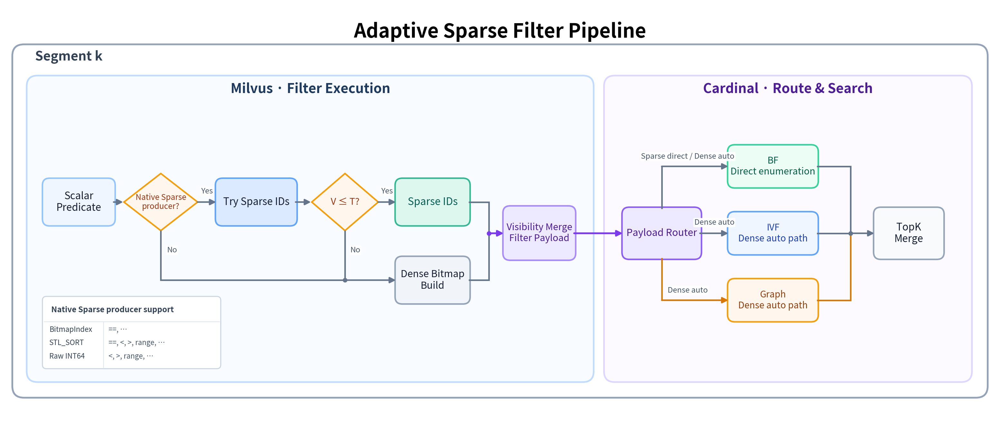
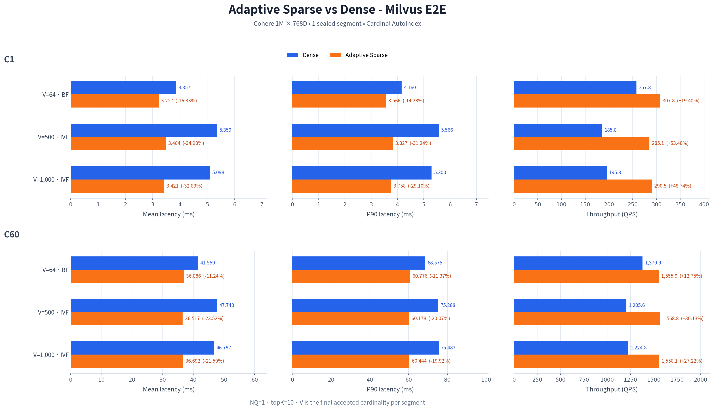

# Adaptive Sparse Filter Design

状态：Draft  
范围：第一阶段架构、验证与落地决策  

关联文档：

- [实验与实现路线](sparse-filter-landing-roadmap.md)
- [P90 定位记录](sparse-p90-tail-investigation.md)

本文是一份面向落地决策的设计文档。历史原型、逐轮实验和归因过程保留在关联文档中；
本文聚焦最终希望形成的执行模型、表示契约、验证证据、trade-off 和落地边界。

## 1. 架构与执行流程

### 1.1 总体方案

现有过滤链默认以 Dense bitmap 表达结果。Adaptive Sparse 方案在不改变过滤语义的
前提下，为每个 segment 增加第二种结果表示：当过滤执行器能够直接
产生少量 accepted row IDs，且其 cardinality `V` 不超过阈值 `T` 时，交付 Sparse ID
payload；其他情况继续交付 Dense bitmap。

该决策是 **per segment** 的。同一次查询可以在不同 segment 上得到不同表示，例如一部分
segment 交付 Sparse IDs，另一部分 segment 因 `V > T` 或 producer 不支持而交付 Dense。
每个 segment 独立完成过滤、visibility 合并和 Cardinal 搜索，再把该 segment 的 TopK
候选交回上层；跨 segment 的最终结果归并不在本图范围内。

Dense payload 继续交给 Cardinal 原有 auto selector，在 BF、IVF 和 Graph 中选择一条路径；
Sparse payload 在 Memory 和 Tiered backend 统一直接进入 BF。三条线汇入 TopK 只表示
它们具有相同的输出契约，不会在同一个 segment 请求中同时执行。

### 1.2 Dense 与 Sparse 表示契约

过滤链允许交付以下两种物理表示：

| 表示 | 语义 | 所有权与生命周期 | 主要用途 |
|---|---|---|---|
| Dense bitmap | `[0, N)` 中 `1` 表示该 row 被过滤 | query/segment search 生命周期内有效 | 通用 membership、既有 index 和兼容路径 |
| Sparse IDs | segment 内 accepted row IDs | query-owned immutable payload | 小集合枚举或 consumer 专用适配 |

第一阶段 Sparse payload 只表达 accepted/valid 一侧，不复用同一接口表达少量 invalid IDs。
Milvus handoff 当前要求 ID：

- 属于当前 segment 的 row-offset universe `[0, N)`；
- 使用 `int32_t`；
- unordered、unique；producer order 是合法顺序；
- payload 自身持有 ID vector，不能引用 scalar index 或临时 evaluator 的短生命周期内存；
- 同时携带 `universe=N`，供下游校验 cardinality、offset 和映射关系。

抽象语义不依赖 Roaring。BitmapIndex 可以继续在 index 内部使用 Roaring posting，但跨越
Milvus/Cardinal 边界的 canonical Sparse 表示是一份 accepted-ID payload，避免把具体
producer 的存储格式暴露给所有 consumer。

### 1.3 Producer capability 与阈值选择

过滤执行器通过统一 adaptive sink 选择最终表示。Native Sparse producer 能在执行原判定
时直接交付 accepted row IDs 或 batch-local accepted mask；其他表达式沿用既有 evaluator，
但把每个 batch 的 accepted mask 直接送入 sink。两者都不得先 materialize 完整 N-bit
Dense bitmap 再扫描生成 Sparse。

当前规划的 native producer 示例为：

| Producer | 已接入的 predicate 示例 |
|---|---|
| BitmapIndex | `==, ...` |
| STL_SORT | `==, <, >, range, ...` |
| Raw INT64 | `<, >, range, ...` |

省略号表示 capability 可以继续扩展，而不是限制该 producer 最终只能支持表中操作。
每种 producer/operator 组合必须显式声明是否支持 native 快路径；不能仅根据 index 名称
假定所有表达式都能绕过普通 evaluator。未实现 native 快路径不等于只能输出 Dense。

单个 predicate 的执行规则如下：

1. 未开启 Adaptive：直接执行既有 Dense 路径，不创建 Sparse ID buffer。
2. 已开启 Adaptive：native producer 或普通 batched evaluator 把当前判定结果直接送入
   adaptive sink；普通 evaluator 只产生原本就需要的 batch-local truth mask。
3. sink 单趟累计 accepted IDs；执行结束时 `V <= T`，交付 Sparse IDs。
4. 收集到第 `T+1` 个 ID：立即切换为 Dense build，最终交付 Dense。

阈值 fallback 不能实现成“先完成一次 Sparse 扫描，再从头重做一次 Dense 扫描”。正确实现
是在超限点把已保存的至多 `T` 个 ID 回填到 Dense，并让当前 chunk 和剩余输入继续通过
原有批量判定路径落入 Dense，因此整体仍保持单趟执行。

### 1.4 复合过滤传播

Adaptive 是过滤结果的表示能力，不与某一个固定 predicate 或固定 A/B 顺序绑定。AND 链中
的每个 predicate 只消费前一个结果并增加自己的过滤条件：

- 输入为 Sparse：只对当前 accepted IDs 应用下一 predicate；若结果仍不超过 `T`，继续
  交付 Sparse；
- 输入为 Dense、下一 predicate 能直接产生 Sparse：枚举下一 predicate 的 accepted IDs，
  通过 Dense membership 保留交集，可把 Dense 中间结果重新收缩为 Sparse；
- 输入与下一 predicate 都为 Dense：沿用既有 Dense AND 组合；
- predicate 不具备对应 capability：进入 Dense 兼容路径。

每个 child predicate 只能执行一次。执行器不应为了寻找“小结果 predicate”而尝试多个
执行顺序，也不能在发现结果不够稀疏后重新执行整条表达式。

第一阶段只让 AND 链传播 Sparse。OR 继续使用 Dense，因为 Sparse union 可能在任意中间点
超过阈值，还涉及 NULL/SQL 三值逻辑和 valid/invalid polarity 的组合语义；这些需要作为
独立设计处理，不能隐式套用 AND 的交集规则。

### 1.5 Visibility 合并

Scalar predicate 产生 accepted IDs 不代表这些 row 在当前查询快照中一定可见。Sparse
payload 必须经过与 Dense 路径相同的 visibility 约束，包括：

- MVCC timestamp；
- delete bitmap；
- collection/entity TTL；
- growing segment 的 active-row boundary；
- nullable scalar predicate 的 valid mask。

Dense 路径继续把 visibility 约束合入 filtered bitmap。Sparse 路径则使用同一 invalid mask
压缩 accepted-ID vector，删除当前快照不可见的 row。只有 visibility 合并完成后，结果
才能成为 canonical filter payload 并交给 VectorSearchNode。

这层设计保证 Sparse 只是物理表示变化，不形成绕过 delete、TTL 或历史快照检查的旁路。

### 1.6 Milvus 到 Cardinal 的 handoff

`QueryContext` 持有 query-owned `SparseIdPayload { ids, universe }`。VectorSearchNode 根据
实际结果选择 Dense bitset 或 Sparse payload，并把表示信息传到 Cardinal/Knowhere search
边界：

- `enableSparseFilterResult` 只决定过滤执行器能否产生 Sparse；
- Dense 仍根据原有 index、filter ratio、topK、search limit 和配置执行 auto route；
- Sparse IDs 在 Cardinal Memory/Tiered 边界统一选择 BF，直接枚举 accepted IDs；

只有明确声明支持 Sparse capability 的 vector index/search API 才能接收 Sparse payload。
非 Cardinal index、legacy iterator 或其他 Dense-only 边界必须在进入前保持/转换为 Dense，
不能把 `bits=null` 的 Sparse view 当作普通 Dense bitset 传入。

### 1.7 Cardinal consumer

Canonical Sparse payload 到达 Cardinal Memory/Tiered 后直接交给 BF consumer：

#### BF

BF 直接枚举 `V` 个 accepted IDs，并对这些 ID 执行 distance/heap 操作。该路径不需要
Dense membership，也不需要构造 Roaring、hash set 或重新排序。

IVF bucket grouping 和 Graph membership adapter 保留为实验实现，但不进入第一阶段 Sparse
route。这样 Sparse consumer 只保留一种执行模型；Dense 的 IVF/Graph 能力和 auto 选择不变。

### 1.8 配置与请求语义

第一阶段保持默认行为不变：

| 配置 | 默认值 | 作用 |
|---|---:|---|
| `queryNode.segcore.enableSparseFilterResult` | `false` | QueryNode 是否允许 Adaptive Sparse 输出 |
| `queryNode.segcore.sparseResultMaxCardinality` | `1000` | per-segment Sparse cardinality cap `T` |

请求级 `filter_result_representation` 语义为：

- `dense`：始终使用 baseline Dense；
- `adaptive`：在 capability 和阈值允许时交付 Sparse，否则合法交付 Dense；
- `sparse`：当前作为实验/诊断入口使用；成功交付 Sparse 后按上述策略直接进入 BF。

请求可覆盖 `sparse_result_max_cardinality` 以执行阈值实验，但产品默认值仍由 QueryNode
配置管理。全局 capability 关闭时，请求不能静默启用 Sparse。

## 2. 测试与结果

### 2.1 测试范围

| 固定项 | 配置 |
|---|---|
| Dataset | Cohere 1M × 768D |
| Vector index | Cardinal AutoIndex；当前测试使用 Tiered backend 和 COSINE |
| Segment topology | 1 个 loaded sealed segment，精确 1,000,000 rows |
| Predicate | `a < V AND b < 1,000,000` |
| Matrix | `V=64/500/1000`，NQ=1，topK=10，C1/C60 |
| Comparison | 初始矩阵保持同一 auto route；决策验证为 Dense auto vs Sparse direct-BF |

由于 `b` 是 `[0, 1,000,000)` 的 permutation，第二个 predicate 对所有 row 都成立；表达式
结构和 scalar data 在六组测试中完全相同，只改变 `a < V` 的数值边界，最终 accepted
cardinality 精确等于 `V`。详细数据生成、预热、ABBA、counter 与复现配置见
[实验与实现路线](sparse-filter-landing-roadmap.md)。

### 2.2 Milvus E2E 结果

初始六组实验保持 Dense/Adaptive 搜索路径一致，用于隔离表示收益：V=64 选择 BF，
V=500/1000 选择 IVF。C1 mean latency 降低 16%--35%，C60 降低 11%--24%；P90
和 QPS 方向一致，未观察到尾延迟劣化。`V=1001` 的 T+1 控制点能够单趟 fallback Dense，
未观察到明显回退，详细数值保留在实验文档。

随后在 V=500、C1 上只把 Sparse route 从 IVF 改为 BF：Dense auto-IVF 为 5.237 ms，
Sparse direct-BF 为 3.347 ms（-36.10%）；Sparse-BF 与此前 Sparse-IVF 的 3.236 ms
处于同一量级。50/50 queries 的 TopK/distance 一致，12/12 paired windows 均改善。

### 2.3 证据边界

统一主结果覆盖单 segment、accepted-ID Sparse、T≤1000、两层 AND、Tiered BF/IVF 和
C1/C60。它不用于外推 Graph、Cardinal Memory E2E、multi-segment mixed payload、OR/NOT、
iterator、非 Cardinal index 或更高阈值；这些能力的验证记录与待办统一维护在实验 roadmap。

## 3. 综合分析与落地决策

### 3.1 技术收益与实验对应关系

Adaptive Sparse 在 native producer 执行原判定时直接得到少量 accepted IDs，并让后续阶段
保持该表示；它不是把已完成的 Dense bitmap 再转换成 list。由此可以删除 N-bit Dense
materialization、恢复 accepted IDs 的 Dense 枚举，以及 consumer 已知 V 很小时对无效范围
进行的部分 membership/scan。统一 768D Milvus E2E 的 mean、P90 和 QPS 变化与该机制一致。

内存方面，单个 N=1M Dense bitmap 的理论 payload 约为 `N/8 ≈ 122 KiB`；`V=1000` 的
`int32_t` Sparse IDs 原始 payload 约 4 KiB，V=64 时约 256 B。该比较只描述表示本身，
不包含 allocator、vector capacity、query object 和 consumer adapter metadata，也不是进程
RSS 实测；但它说明在 `V << N` 时 Sparse 有明确的 payload-size 上界优势。

### 3.2 Sparse 统一选择 BF

Sparse IDs 已经给出需要搜索的完整 accepted set，BF 可以直接枚举 V 个 ID，不需要构造
IVF bucket grouping 或 Graph membership。V=500 的快速对照表明，Sparse-BF 与此前
Sparse-IVF 的性能差异不大，同时 BF 对 accepted set 做完整扫描，避免引入额外的近似召回
损失。因此第一阶段选择更简单的统一策略：Memory/Tiered 收到 Sparse 就走 BF；Dense
仍由原 selector 自适应选择 BF、IVF 或 Graph。

### 3.3 并发、尾延迟与运行成本

C60 下收益相对 C1 有所稀释，但六组 mean、P90 和 QPS 仍一致改善，说明收益在当前并发
范围内没有被调度、排队和公共搜索成本完全吞没；它也不代表更高并发或生产负载下仍保持
相同比例。

Sparse 并非零成本。producer 需要维护最多 T 个 IDs；payload handoff 还需要所有权和
universe 校验，BF 需要对 V 个向量完成 distance/TopK。当 V
超过阈值时，这些工作必须通过单趟 fallback 控制在小常数范围内。`T=1000` 是当前有数据
支持的保守默认值，不应仅依据表示内存公式直接扩大。

### 3.4 方案对比与 trade-off

| 维度 | Dense baseline | Adaptive Sparse |
|---|---|---|
| 通用性 | 已覆盖现有 predicate/index/iterator 路径 | 依赖 producer 与 consumer capability；未支持边界需保持 Dense |
| 结果构造 | 固定 N-bit 输出，易于批量 SIMD 写入 | V≤T 时 O(V) payload；producer 必须 native 输出，禁止 Dense 后转换 |
| BF | Dense 批量枚举后搜索 V 个点 | 直接枚举 V，已测 mean/P90/QPS 均改善 |
| IVF / Graph | Dense auto selector 的成熟路径 | Sparse 第一阶段不进入；统一改走 BF，减少 adapter 与策略复杂度 |
| 内存 | 每个 segment/request 约 N bits | 原始 ID payload 约 4V bytes，V≪N 时更小；adapter metadata 另计 |
| 阈值外成本 | 无 Sparse 尝试 | 最多暂存 T 个 IDs并单趟切 Dense；当前 T+1 控制点未见回退 |
| 工程复杂度 | 单一表示和既有 consumer 契约 | 增加 producer/consumer capability、payload 生命周期和 fallback 边界 |

### 3.5 建议决策

**建议采用，但按 capability-gated、默认关闭的第一阶段方案落地，不替换全局 Dense。**

采用理由：

- producer、handoff 和 BF consumer 已形成完整执行模型；
- 统一 768D Milvus E2E 及 V=500 direct-BF 对照均获得可重复的 mean、P90 和 QPS 收益；
- T+1 控制点支持低成本单趟 fallback；
- V≪N 时表示内存具有明确的数量级优势。

第一阶段建议边界：

1. `enableSparseFilterResult=false` 保持默认 baseline；仅显式开启时允许 Adaptive；
2. 保持 `T=1000`，按 segment 独立决策；V>T 或 capability 不满足时交付 Dense；
3. 只允许已声明 native Sparse producer 且完成 visibility 语义闭环的 AND 路径；
4. Cardinal Memory/Tiered 收到 Sparse 后统一走 BF；Dense 继续使用原 auto selector；
5. Sparse 的 IVF/Graph adapter 不进入第一阶段；OR/NOT、iterator 和非 Cardinal index
   在完成独立准入前保持 Dense。

后续扩大范围应按独立能力逐项准入，而不是直接提高全局阈值；具体测试和实现待办统一维护在
[实验与实现路线](sparse-filter-landing-roadmap.md)。
